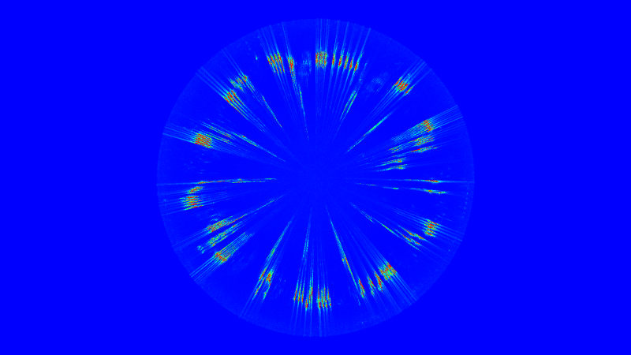

# PixelsAndSound

[Processing] sketch using [minim] sound library.

It draws a circular sound spectrogram.

*Eurasian Nuthatch singing in the mountains of Gredos.*

[minim]:<http://code.compartmental.net/minim/index.html>
[Processing]:<https://processing.org/>